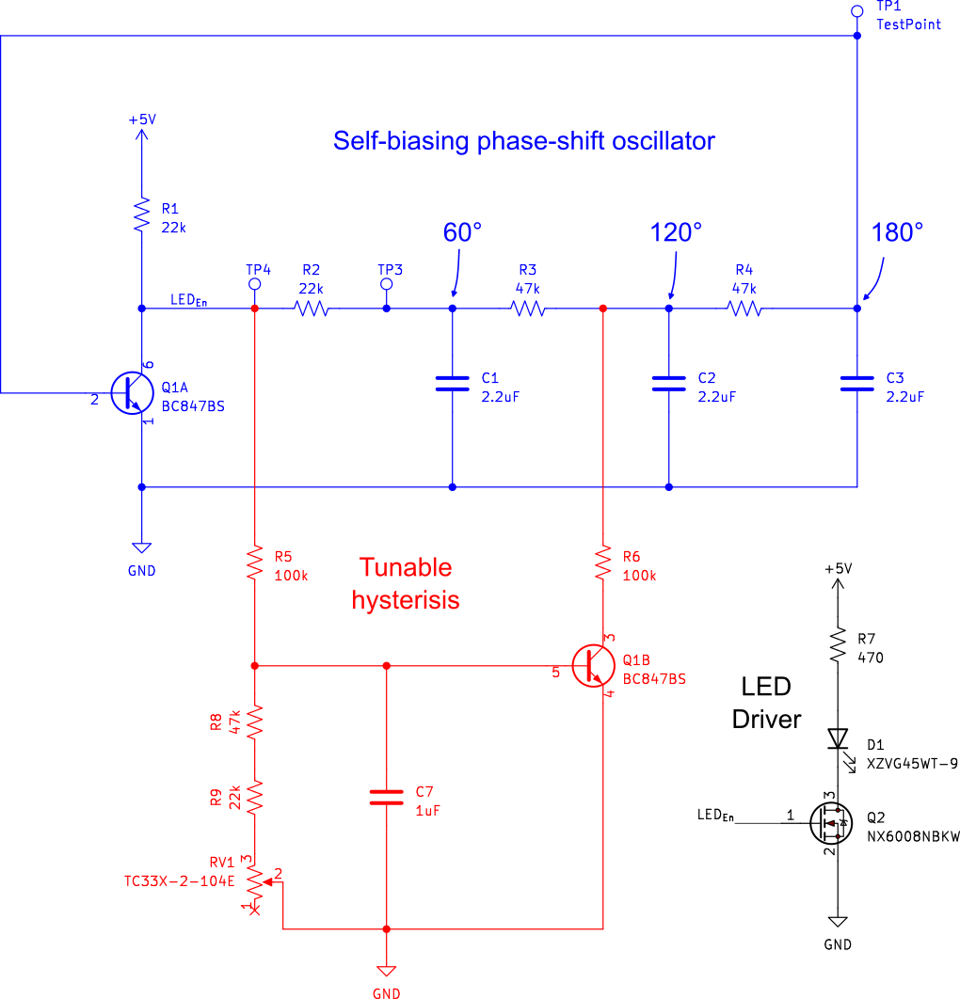

# Blinkenbrain
A mouse brain pendant with chaotic tendencies. It implements a variant of the circuit described in

```
Simple Two-Transistor Single-Supply Resistor–Capacitor Chaotic Oscillator
Lars Keuninckx, Guy Van der Sande, and Jan Danckaert
IEEE TRANSACTIONS ON CIRCUITS AND SYSTEMS—II: EXPRESS BRIEFS, VOL. 62, NO. 9, SEPTEMBER 2015
```

and uses its strange dynamics blink a blinkenlight.


## How does it blink?


The circuit consists of a RC phase shift oscillator (blue) combined with what amounts to a tunable Schmitt trigger (red).
The position of the trimpot (RV1) determines if the effect of Q1B on this oscillator.

- When the wiper of RV1 is tuned to ground, Q1B does not conduct, and the Schmitt trigger is effectively removed from the circuit
- When the wiper of RV1 is tuned to 100k, Q1B acts as trigger without hysteresis, and therefore conducts synchronously with the
  RC oscillator.
- When the wiper of RV1 is turned in between these two extremes, a hysteretic path is formed between Q1B's conducting and non-conducting states,
  which results in the emergence of two interacting unstable equilibria and, for some values of RV1, chaotic dynamics.

The gate of an N-channel MOSFET is tied to the collector of Q1A to drive the LED without influencing the
circuit's dynamics. For a complete explanation, see the above referenced paper.

## License
"No Rights Reserved", CC0
